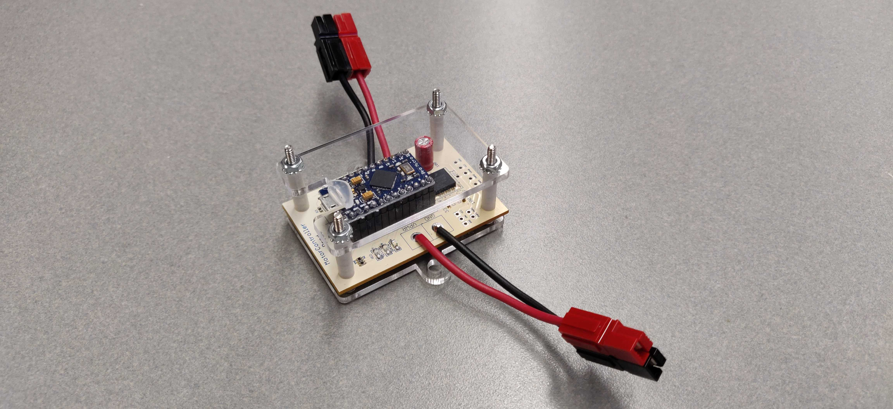
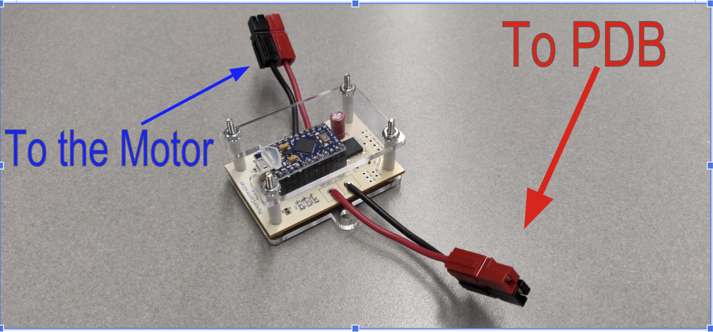

Motor Controller (Polar Bear)
==========

A Polar Bear is a motor controller included in all kits. Its sole purpose is to communicate with the motor and provide the ability to drive it as well as to receive information from it. The Polar Bear provides direct drive through PWM inputs. The Polar Bear also has an internal safety feature called Current Limiting.
>
[Types of Control](#control)
[Current Limiting](#current)
[LED Indicator](#LED)
[Wiring](#wiring)

---

## Types of Control 

### Direct Drive
The motor can be controlled directly using PWM (Pulse Width Modulation) values (also known as duty cycle). [Here's](https://www.arduino.cc/en/Tutorial/PWM) a bit more information about PWM for those interested. These values are from -1 to 1 and describe both the direction and power of the motor. A positive value indicates clockwise motion, a negative value indicates counterclockwise motion, and the absolute value controls the power in the specified direction. What this means is that a PWM of 1 would drive the motor at full power in one direction and -1 would be full power in the opposite direction.

---

## Wiring

Polar Bear should be connected to the PDB through the Andersons connected to VPWR and GND (red and black wires respectively). It should be connected to the motor through the Andersons connected to OUT1 and OUT2 (red and black wires respectively).

**Known Issues**

_TBD_